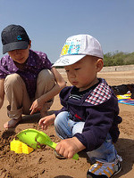



### About me

    

In IT industry (码农), living in Beijing China.  Loves freedom and simplicity.
Unix guy, Vim user, Mac user, open source enthusiast, likes to implement tools
and automation with bash and python.  Likes to drive manual transmission cars.
Likes [Weiqi](http://en.wikipedia.org/wiki/Weiqi) (entry level, just enough to
enjoy it).  Hates most in the world is unproductive meeting.

I am happily married to [Cynthia](http://joyus.net), we have a boy child
petnamed _Tutu_ who born in Chinese new year 2012.  I am being proud as a busy
daddy enjoying everyday with him.

     
    
<small>Cynthia and Tutu, May 2013</small>

I have a female dog named _Diudiu_ (means "loss") who lived with us from August
2005 (when she was just one month old) until Tutu turned 6 months old.  She is
now happier because of the freedom she has in the village.

     
    
<small>Diudiu, Oct. 2008</small>

I used to writing [blog](/blog.html) but posts there are now just some boring
technical notes.

This page and blog posts are powered by [GitHub Pages](http://pages.github.com/),
check out [my repositories](https://github.com/ymattw/) on GitHub :-)

> A loss may turn out to be a gain (Huainanzi).

Be happy, don't get angry.

### Contact

I can be reached via email address <code>matt<!-- nospam -->wyl&#x40;gma<!--
nospam -->il&#x2e;com</code> or twitter [@ymattw](https://twitter.com/ymattw).
